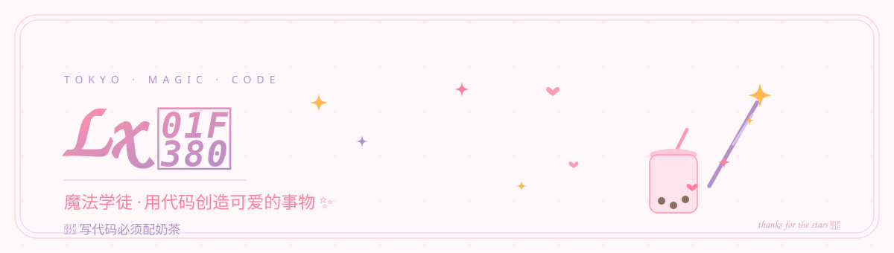

  

 

  <em>魔法学徒 · 今天也在努力消灭 Bug ✨</em>

  

 

<h2>🌸 关于我</h2>
- 🪄 魔法学徒,用代码变小小的戏法
- 🍵 奶茶是写代码的必需燃料
- 🌟 欢迎给我的项目点亮小星星
- 💻 偶尔制造 Bug,努力消灭 Bug

 

<h2>🛠️ 魔法工具箱</h2>

  
  
  
  
  
  

 

<h2>📊 修行数据</h2>

  
  

 

<h2>📝 魔法修行日志</h2>
- [x] 学会一个新咒语
- [ ] 消灭今天的全部 Bug
- [ ] 收集 100 颗小星星

 

  💗 谢谢你来过我的魔法小屋 🌟

